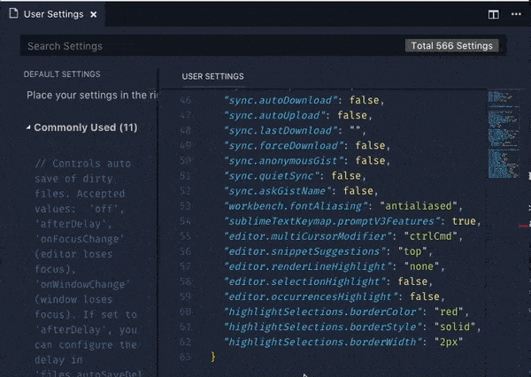
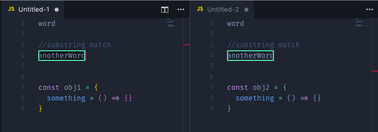

# Highlight Selections VS Code

> Enhanced selection(s) highlighting for your text editor.

## Features

### Flexible Selection Matching

>

### Customizable Settings
Through the configuration options, you can edit appearance of your hilighted line and see the changes take effect immediately in your editor.

>

 

<table>
  <tr>
    <th colspan="2">Highlight Selections Settings</th>
  </tr>

  <tr align="left">
    <th>Name</th>
    <th>Description</th>
  </tr>

  <tr>
    <td><code>highlightLine.borderColor</code></td>
    <td>Specifies the border color used & is changable to any valid CSS color value. For example here are a list of valid values: 'red', '#FFF' '#FFFFFFF', 'RGB(255,255,255)', 'RGB(255, 255, 255. 0.5)'</td>
  </tr>
  <tr>
    <td><code>highlightLine.borderWidth</code></td>
    <td>Specifies the width of the border in pixels For example: `'2px'` </td>
  </tr>
  <tr>
    <td><code>highlightLine.borderStyle</code></td>
    <td>Specifies the border style of the line. For example, here a a list of valid values: 'solid', 'dashed', 'inset', 'double', 'groove', 'outset', 'ridge'</td>
  </tr>
  </table>

 

### Multi-Tab Support

>
